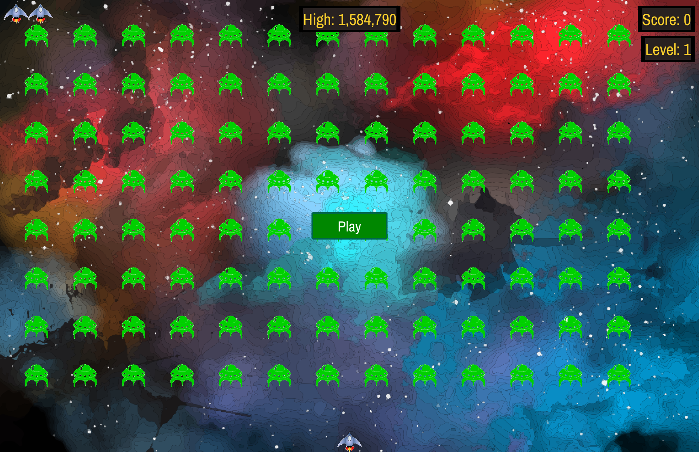

# Enhanced Alien Invasion

This is an improved version of the *"Alien Invasion"* game from the book ["Python Crash Course" 3rd Edition](https://nostarch.com/python-crash-course-3rd-edition) by Eric Matthes, and published by No Starch Press.  Alien Invasion is a python take on the classic Arcade game "Space Invaders" using the pygame 2D open source graphics library.

The development of the Alien Invasion game is covered in chapters 12, 13 & 14

The code in this project is based on the book, but was written as I read through the chapters.  There are numerous small changes I made to suit my preference or fix problems.  It was *not* based on the author's git repository, (other than as the source of the original ship and alien images).  

Should you choose to utilize this code, I recommend examining the source in this repository, as it was not designed or intended to expand upon the source in the course repository. 

## Enhancements
This version has a number of enhancements that you might find interesting.

- A background image was added
- The original ship and alien bmp images were reworked to have transparent backgrounds
- The original images were reworked into png files with alpha channel transparent backgrounds
- A 2nd alien image was created to so the alien could have a simple animation
- Sprite animation was created for the alien
- A google font was loaded rather than depending on the Pygame system font
- When the ship fires missiles (bullets) there's a sound effect
- The game start button has been improved to have a border
- Game status windows were improved to have borders
- High score is saved in a json file
- Added a screenshot key

## How to run
- Download or clone this repository.
- I recommend you utilize the [uv dependency management tool](https://docs.astral.sh/uv/).

*From a terminal:*
- Change directory to the project directory
- `uv run alien_invasion.py`

In some cases, a pygame window will be launched minimized.  Try to click on the pygame application icon.  If you are using multiple desktops, it helps to have an empty one selected before you click on the running pygame icon. 

## How to play
*Keys*

| Function   |     Key      |
| ---------- | ------------ |
| Move Left  | Left Arrow   |
| Move Right | Right Arrow  | 
| Fire       | Space Bar    | 
| Screenshot | s            | 
| Quit       | q            | 

## Additional Credits

*Background Image:*
- "Designed by rawpixel.com / Freepik"

*Sound effects:*
- 441500__mattix__8bit-spaceship-02.wav
- url: https://freesound.org/s/441500/
- license: Creative Commons 0 

### Tools utilized in creation and rendering of images:

- Affinity Photo - Image background removal and format conversion
- Pixelorama - Pixel art editing
- Google Fonts - For Archivo Narrow Font
Copyright 2019 The Archivo Narrow Project Authors (https://github.com/Omnibus-Type/ArchivoNarrow)

### License
This code was based on the [Eric Matthes book](https://nostarch.com/python-crash-course-3rd-edition), and is provided as is for educational purposes only.  